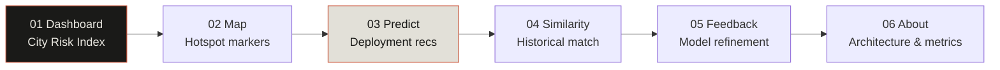
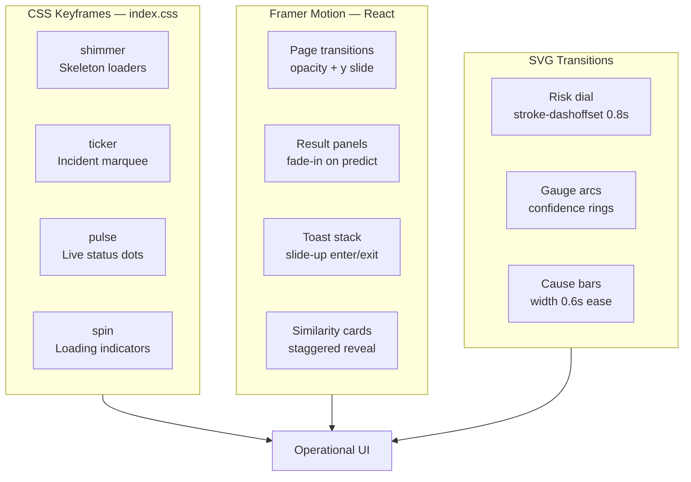
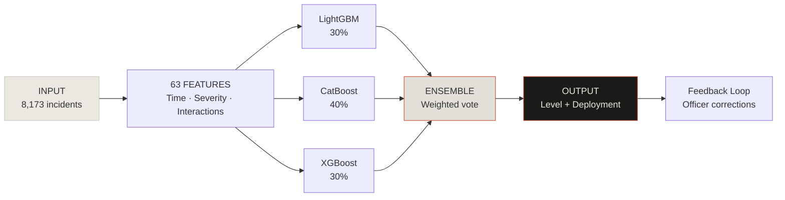

<div align="center">

# gridsense

**AI Traffic Operations Co-pilot for Bangalore**

Predict congestion severity · Deploy officers intelligently · Learn from past incidents

<br />


*Gridlock Hackathon 2.0 · Theme 2 — Bangalore Traffic Intelligence*

</div>

---

## Overview

GridSense is an operational decision-support dashboard built for **Bangalore Traffic Police**. It ingests 8,173 historical incidents (Jan–May 2024), predicts congestion severity (Low / Medium / High) for new events, and generates deployment recommendations — officer counts, barricades, diversion routes — backed by similarity matching and a continuous feedback loop.

Every panel shows **real API data** when the backend is connected. Demo fallback data activates gracefully when the API is unavailable — never empty charts, never dead buttons.

---

## Table of Contents

- [Quick Start](#quick-start)
- [Demo Flow (60 seconds)](#demo-flow-60-seconds)
- [Pages & Routes](#pages--routes)
- [Features](#features)
- [Animations & Motion System](#animations--motion-system)
- [AI Architecture](#ai-architecture)
- [Design System](#design-system)
- [API & Environment](#api--environment)
- [Project Structure](#project-structure)
- [Tech Stack](#tech-stack)

---

## Quick Start

### Prerequisites

- **Node.js** 18+
- **pnpm** (workspace uses pnpm exclusively)

### Install & Run

From the monorepo root:

```bash
pnpm install
```

From the GridSense package:

```bash
cd artifacts/gridsense

# Required environment variables
set PORT=5173
set BASE_PATH=/

# Optional — override ML backend URL
set VITE_API_URL=https://gridsense-backend-tp2m.onrender.com

pnpm dev
```

Open **http://localhost:5173**

### Build for Production

```bash
set PORT=5173
set BASE_PATH=/
pnpm build
pnpm serve
```

### One-Click Judge Demo

Click **▶ LOAD JUDGE SCENARIO** in the sidebar. This:

1. Navigates to `/predict`
2. Auto-fills the *Public Event – Mysore Road* scenario
3. Fires a real `POST /predict` call
4. Populates the result panel with live model output

No scripted animation — one real API call, pre-filled for speed.

---

## Demo Flow (60 seconds)



| Step | Route | What to show judges |
|------|-------|---------------------|
| **01** | `/` | City Risk Index dial, live alert feed, incident ticker |
| **02** | `/map` | Duration-classified markers, fly-to on list click |
| **03** | `/predict` | Scenario pill → result panel → What-If simulation |
| **04** | `/similar` | Cosine similarity across 63 features |
| **05** | `/feedback` | Officer ground-truth → accuracy gauge update |
| **06** | `/about` | F1, recall, model objective, dataset provenance |

---

## Pages & Routes

| Route | Page | Description |
|-------|------|-------------|
| `/` | **Dashboard** | City Risk Index, analytics charts, incident log |
| `/map` | **Incident Map** | Leaflet map with classified hotspot markers |
| `/predict` | **Predict Event** | Form + deployment recommendations + simulations |
| `/similar` | **Similarity Search** | Top-3 historical matches by feature cosine distance |
| `/feedback` | **Officer Feedback** | Submit outcomes, view accuracy history |
| `/about` | **About** | Problem, solution, architecture, metrics |

**Mobile:** Bottom nav bar (Dashboard · Predict · Map · Similarity · About) at `<768px`.

---

## Features

### Operational Intelligence

- **City Risk Index** — Composite score from high-priority events, road closures, and corridor risk. SVG risk dial with critical-state digit blocks. Expandable detail drawer per column.
- **Live Alert Feed** — Real activity log driven by user actions (predictions, similarity searches, feedback).
- **Active Incidents Ticker** — CSS marquee of high-priority events from `/events`.

### ML / Decision Support

- **Congestion Prediction** — 3-model ensemble (LightGBM 30% · CatBoost 40% · XGBoost 30%).
- **Explainable AI** — Contributing factors panel derived from domain-engineered features.
- **Resource Optimizer** — Officer savings vs fixed-rule deployment baseline.
- **What-If Simulation** — Side-by-side comparison: road closure ON/OFF, planned vs unplanned.
- **Similarity Search** — Cosine distance across all 63 normalized features.

### Reliability

- **Demo fallback** (`src/data/demoData.ts`) when API returns null/error.
- **5s API timeout** with graceful degradation.
- **Skeleton loaders** on every data-fetching panel.
- **Error blocks** with `RETRY →` on failed fetches.
- **Toast notifications** (success / error / info, auto-dismiss 3s).
- **Backend health check** every 30s in the top bar.

---

## Animations & Motion System

GridSense uses a layered motion system — purposeful animation that communicates state, never decorative theater.

### Motion Layers



### Animation Reference

| Animation | Location | Trigger | Duration | Easing |
|-----------|----------|---------|----------|--------|
| **Page enter** | All pages | Route change | 250ms | `easeOut` |
| **Page exit** | All pages | Route leave | 250ms | `easeOut` |
| **Result panel** | `/predict` | Prediction complete | 300ms | `easeOut` |
| **Shimmer** | `Skeleton.tsx` | Data loading | 1.5s loop | `ease-in-out` |
| **Cause bars** | Dashboard | Chart mount | 600ms | `ease` |
| **Risk dial** | City Risk Index | Score computed | 800ms | `ease-out` |
| **Detail drawer** | City Risk Index | Column click | 300ms | `ease-out` |
| **Incident ticker** | Dashboard | Always on | 40s loop | `linear` |
| **Live pulse** | TopBar, Alert Feed | Always on | 1.5–2s loop | `cubic-bezier` |
| **Toast slide-up** | Bottom-right | API events | 250ms | Framer default |
| **Map flyTo** | `/map` | List item click | 1s | Leaflet default |
| **Count-up** | Stat cards | Data load | 800ms | `requestAnimationFrame` |
| **Corner marks** | Predict result, Map selection | Active state | instant | — |

### Page Transition (Framer Motion)

Every page wraps content in:

```tsx
<motion.div
  initial={{ opacity: 0, y: 8 }}
  animate={{ opacity: 1, y: 0 }}
  exit={{ opacity: 0, y: -4 }}
  transition={{ duration: 0.25, ease: 'easeOut' }}
>
```

Routes use `<AnimatePresence mode="wait">` in `App.tsx` for clean cross-fades.

### Skeleton Shimmer

```css
@keyframes shimmer {
  0%   { background-position: -200% 0; }
  100% { background-position:  200% 0; }
}
```

Applied via `Skeleton` component (`height`, `width`, `lines` props) across dashboard cards, charts, tables, and result panels.

### City Risk Index Dial

The app's signature animation — SVG `stroke-dashoffset` transitions from empty to score value:

```tsx
strokeDasharray="238.7"
strokeDashoffset={238.7 * (1 - score / 100)}
// transition: stroke-dashoffset 0.8s ease-out
```

**Critical state (`score > 60`):** Dial center switches from calm inline text to dramatic terracotta digit blocks.

### Toast Stack

`ToastContext` manages a max-3 stack with Framer Motion:

- **Enter:** `opacity: 0 → 1`, `y: 16 → 0`
- **Exit:** `opacity: 1 → 0`, `y: 0 → 8`
- **Auto-dismiss:** 3 seconds

Triggered on: prediction complete, feedback submit, simulation run, API errors.

---

## AI Architecture



### Model Metrics

| Metric | Value | Notes |
|--------|-------|-------|
| F1 Score (macro) | **0.640** | Stratified 80/20 hold-out |
| Accuracy | **63.8%** | Secondary to recall |
| High-risk recall | **75.5%** | Primary optimization target |
| Features | **63** | Domain-engineered per incident |

**Model objective:** Maximize recall of HIGH-risk incidents, even at the cost of additional false positives. Missing a critical event costs more operationally than over-preparing.

---

## Design System

Operational tools aesthetic — parchment background, terracotta accent, sharp corners. No gradients, no glow, no generic AI dashboard tropes.

### Color Tokens

| Token | Hex | Usage |
|-------|-----|-------|
| Background | `#EAE8E1` | Page shell |
| Surface | `#E2E0D8` | Cards, panels |
| Border | `#C8C5BC` | Panel dividers |
| Text | `#1A1A18` | Primary content |
| Muted | `#9A9690` | Labels (9px mono uppercase) |
| Accent | `#C84B2F` | High risk, critical |
| Warning | `#B8820A` | Medium risk, elevated |
| Success | `#2D6A4F` | Low risk, live status |
| Ops Blue | `#4A6E8A` | Info, planned alerts |

### Typography

| Role | Font | Size |
|------|------|------|
| Display headings | Space Grotesk | 44–52px lowercase |
| Body | Space Grotesk | 13px |
| Labels | Space Mono | 9px uppercase, `letter-spacing: 0.12em` |
| Data values | Space Mono | varies |
| Buttons | Space Mono | 11px uppercase |

### Visual Focus Indicators

- **Corner tick marks** (`CornerMarks.tsx`) — L-shaped brackets on active predict result panel and selected map list items.
- **Grain texture** — Subtle cross-hatch overlay (4% opacity) on City Risk Index panel only.
- **Sparklines** — 5-month trend bars on Total Incidents and Road Closures stat cards.

---

## API & Environment

### Backend

Default ML API: `https://gridsense-backend-tp2m.onrender.com`

Override with `VITE_API_URL` at build/dev time.

### Endpoints

| Method | Path | Purpose |
|--------|------|---------|
| `GET` | `/health` | Backend connectivity check |
| `GET` | `/summary` | Dashboard summary stats |
| `GET` | `/analytics` | Chart data (causes, hours, corridors) |
| `GET` | `/events` | Incident log with filters/pagination |
| `GET` | `/hotspots` | Map marker coordinates |
| `POST` | `/predict` | Congestion prediction + deployment |
| `GET` | `/similar/:id` | Top similar historical events |
| `POST` | `/feedback` | Submit officer ground-truth |
| `GET` | `/feedback` | Feedback history + accuracy |
| `GET` | `/meta/causes` | Event cause dropdown |
| `GET` | `/meta/corridors` | Corridor dropdown |
| `GET` | `/meta/zones` | Zone dropdown |

### Environment Variables

| Variable | Required | Default | Description |
|----------|----------|---------|-------------|
| `PORT` | Yes | — | Vite dev/preview server port |
| `BASE_PATH` | Yes | `/` | Router basename |
| `VITE_API_URL` | No | Render URL above | Flask ML API base URL |

### Demo Fallback

When any endpoint returns `null` (timeout, error, empty), the client loads curated data from `src/data/demoData.ts`. The City Risk Index system status column shows **◉ DEMO DATA** (amber) vs **◉ LIVE DATA** (green).

---

## Project Structure

```
artifacts/gridsense/
├── src/
│   ├── api/
│   │   └── client.ts          # Axios client, 5s timeout
│   ├── components/
│   │   ├── dashboard/
│   │   │   ├── CityRiskIndex.tsx
│   │   │   └── AlertFeed.tsx
│   │   ├── layout/
│   │   │   ├── Shell.tsx      # Desktop grid + mobile bottom nav
│   │   │   ├── Sidebar.tsx
│   │   │   ├── TopBar.tsx
│   │   │   └── StatusBar.tsx
│   │   └── ui/
│   │       ├── Badge.tsx      # Priority/status badges
│   │       ├── Skeleton.tsx   # Shimmer loaders
│   │       ├── CornerMarks.tsx
│   │       ├── OpsButton.tsx
│   │       └── ...
│   ├── context/
│   │   ├── ToastContext.tsx   # Toast stack (Framer Motion)
│   │   └── AlertFeedContext.tsx
│   ├── data/
│   │   └── demoData.ts        # Graceful degradation data
│   ├── hooks/
│   │   ├── useAnalytics.ts
│   │   ├── usePredict.ts
│   │   └── useMeta.ts
│   ├── pages/
│   │   ├── Dashboard.tsx
│   │   ├── Predict.tsx
│   │   ├── Map.tsx
│   │   ├── Similarity.tsx
│   │   ├── Feedback.tsx
│   │   └── About.tsx
│   ├── utils/
│   │   └── predictUtils.ts    # Contributing factors, baselines
│   ├── App.tsx
│   └── index.css              # Keyframes: shimmer, ticker, pulse, spin
├── public/
├── vite.config.ts
└── package.json
```

---

## Tech Stack

| Layer | Technology |
|-------|------------|
| Framework | React 19 + TypeScript |
| Build | Vite 6 |
| Styling | Tailwind CSS 4 |
| Animation | Framer Motion |
| Charts | Recharts |
| Maps | Leaflet + react-leaflet |
| HTTP | Axios |
| Routing | React Router 7 |
| Fonts | Space Grotesk + Space Mono |

---

## Data Provenance

| Field | Value |
|-------|-------|
| Dataset | Bangalore Traffic Incident Dataset |
| Records | 8,173 incidents |
| Period | January – May 2024 |
| Fields | Cause, Corridor, Zone, Priority, Road Closure, Police Station, Duration, Time Features |

---

<div align="center">

**GridSense** — *Predict. Deploy. Prevent.*

Built for Bangalore Traffic Police · Gridlock Hackathon 2.0

</div>
